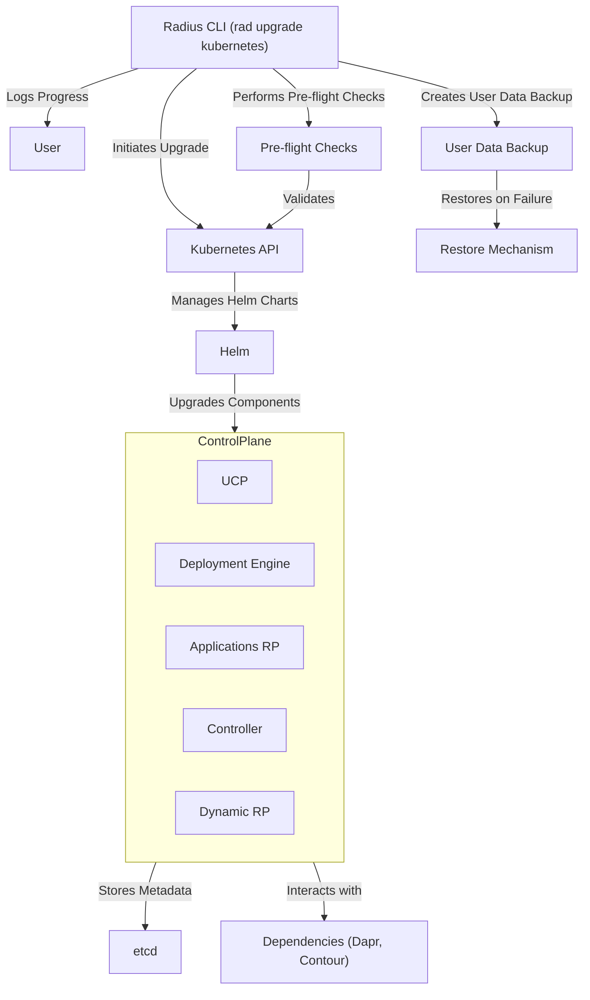
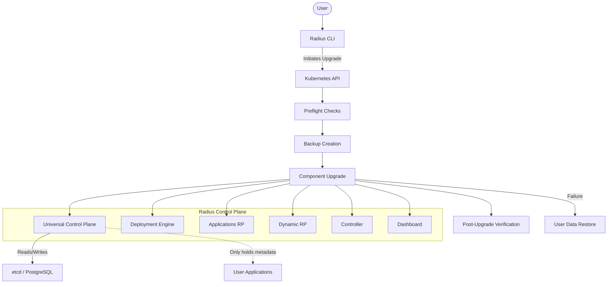
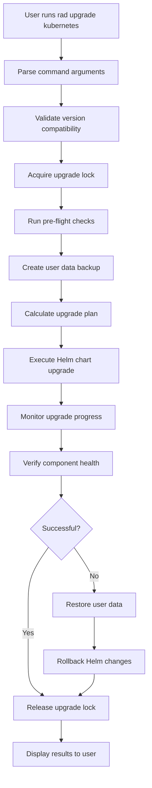

# Radius Control Plane Upgrades

- **Author**: Yetkin Timocin (@ytimocin)

## Overview

Radius is an open-source, cloud-native application platform that enables developers and operators to define, deploy, and collaborate on applications across cloud environments. As Radius evolves with new features and improvements, users need a reliable way to upgrade their installations without disruption or data loss.

This feature introduces in-place upgrades for the Radius Control Plane, allowing users to seamlessly update their Radius installations to newer versions without the current cumbersome process of uninstalling and reinstalling. By running a single command (`rad upgrade kubernetes`), users can update all Radius components while preserving their application deployments and configurations. **It's important to note that user applications deployed through Radius continue running without interruption during this process, as Radius only maintains deployment metadata and does not directly control application runtime execution.**

## Terms and definitions

| Term                     | Definition                                                                                                                                                                                                                                                                                                                                                                   |
| ------------------------ | ---------------------------------------------------------------------------------------------------------------------------------------------------------------------------------------------------------------------------------------------------------------------------------------------------------------------------------------------------------------------------- |
| **Radius Control Plane** | The set of management components in Radius that coordinate application lifecycle operations. These include the Universal Control Plane, Deployment Engine, Applications Resource Provider, etc.                                                                                                                                                                              |
| **In-place Upgrade**     | An upgrade approach that updates an existing Radius installation in its current location without requiring complete reinstallation. The process preserves all user data, configurations, and deployed application metadata while minimizing downtime of the control plane. This contrasts with alternative approaches like parallel deployments or complete reinstallations. |
| **Rolling Upgrade**      | An upgrade strategy that updates components incrementally (one by one) rather than all at once, reducing downtime.                                                                                                                                                                                                                                                           |
| **User Data Backup**     | A point-in-time backup of user data taken before an upgrade to enable recovery if problems occur.                                                                                                                                                                                                                                                                            |
| **User Data Restore**    | The process of reverting user data to a previously backed up state after an upgrade attempt encounters issues.                                                                                                                                                                                                                                                               |
| **Dry-run**              | A simulation mode that validates what would happen during an upgrade without actually making changes, helping identify potential issues.                                                                                                                                                                                                                                     |
| **Pre-flight Checks**    | Validation steps performed before an upgrade to ensure prerequisites are met and the system is in a valid state for upgrading.                                                                                                                                                                                                                                               |
| **Version Skipping**     | The ability to upgrade directly from one version to a newer non-adjacent version (e.g., v0.40 → v0.44) without installing intermediate versions.                                                                                                                                                                                                                             |

## Assumptions

1. User has enough permissions.
2. Kubernetes cluster has enough resources.

## Objectives

> **Issue Reference:** <https://github.com/radius-project/radius/issues/8095>

### Goals

- **Simplify upgrade process**: Provide a single CLI command (`rad upgrade kubernetes`) to upgrade Radius without manual reinstallation.
- **Ensure data safety**: Implement automatic user data backups before upgrades and restore capability if failures occur.
- **Minimize downtime**: Use rolling upgrades where possible to keep Radius control plane available during the upgrade process.
- **Preserve application continuity**: Ensure that user applications continue running without interruption throughout the Radius upgrade process.

### Non goals

- **Downgrade support**: The upgrade process is designed to move forward to newer versions only. Downgrading to previous versions is not supported.
- **Multi-cluster upgrades**: Managing upgrades across multiple clusters simultaneously is out of scope, as Radius doesn't support multiple clusters per installation as of March 2025.
- **Dependency major version upgrades**: Upgrading major versions of dependencies like Postgres, Dapr, or Contour is not covered. These upgrades should be handled separately following their respective guidelines.
- **Full Helm upgrade support**: While we use Helm internally, making `helm upgrade` work completely for Radius is not in scope. Running `helm upgrade` on a Radius Helm installation doesn't configure all necessary components for the control plane to work properly.
- **Zero-downtime control plane**: While we aim to minimize disruption to the control plane itself, guaranteeing absolutely no downtime for the Radius control plane components is not a goal for this initial release.
- **Automatic CLI upgrades**: The upgrade command updates only the Radius control plane components running in Kubernetes. It does not automatically update your local Radius CLI version. You must manually download and install the matching CLI version separately.
- **Application management during upgrades**: Since Radius only maintains deployment metadata and doesn't control runtime execution of user applications, managing or modifying user workloads during the upgrade is explicitly not in scope.

### User scenarios (optional)

**Important Note:** Radius upgrades only affect the control plane components and deployment metadata. User applications deployed through Radius continue running without interruption, as Radius does not manage their runtime execution.

The primary users of this feature are system administrators, application developers, and DevOps engineers responsible for maintaining and upgrading the Radius platform.

- **System Administrator**:
  Responsible for managing the infrastructure and ensuring the smooth operation of the Radius platform. They have advanced knowledge of Kubernetes administration and are concerned with stability, security, and minimizing downtime during upgrades. They need clear visibility into the upgrade process and rollback options if issues occur.
- **DevOps Engineer**:
  Focused on automating deployment processes and maintaining the CI/CD pipeline. They typically integrate Radius into larger workflows and want predictable, scriptable upgrade paths that can be incorporated into their automation systems. They value features like dry-run capabilities and detailed logging of the upgrade process.
- **Application Developer**:
  Uses Radius to deploy and manage their applications but isn't deeply involved in platform administration. They primarily care that their applications continue running during Radius upgrades and that any API or interface changes are clearly documented.

#### Scenario 1: System Administrator performs a standard version upgrade

**User Story:** As a system administrator, I need to upgrade Radius to a newer version while ensuring minimal disruption to user applications running on the platform.

**User Experience:**

```bash
# Check current Radius version
> rad version
RELEASE   VERSION   BICEP     COMMIT
0.44.0    v0.44.0   0.33.93   1dd17270ec9bc9e764f314fa62c248406034edda

# Perform a basic upgrade to a specific version
> rad upgrade kubernetes --version v0.45.0

Initiating Radius upgrade from v0.44.0 to v0.45.0...
Pre-flight checks:
  ✓ Valid version target
  ✓ Compatible upgrade path
Creating backup of current user data...
  ✓ Backup created successfully
Upgrading control plane components:
  ✓ Universal Control Plane
  ✓ Deployment Engine
  ✓ Applications Resource Provider
  ✓ Controller
  ✓ ...
Performing post-upgrade verification...
  ✓ All components healthy

Upgrade complete! Radius has been successfully upgraded to v0.45.0.
Note: Your local Radius CLI is still v0.44.0. To upgrade your CLI, download the v0.45.0 version.
```

**Result:**

1. Pre-flight checks validate the upgrade is possible
1. System automatically creates a user data backup for recovery
1. All control plane components are upgraded in sequence
1. Post-upgrade verification confirms system health
1. User is notified about the CLI version mismatch

**Exceptions:**

1. If version check fails because the target is lower than current version
1. If components fail health checks after upgrade
1. If user lacks sufficient cluster permissions
1. If there is not enough resources for the new version

#### Scenario 2: DevOps engineer upgrades with custom configuration

**User Story:** As a DevOps engineer, I need to upgrade Radius with custom configuration parameters to match organization's infrastructure requirements.

**User Experience:**

```bash
# Upgrade with custom configuration values
> rad upgrade kubernetes --version v0.44.0 --set global.monitoring.enabled=true --set global.resources.limits.memory=2Gi

Initiating Radius upgrade from v0.43.0 to v0.44.0 with custom configuration...
Custom configuration detected:
  - global.monitoring.enabled: true
  - global.resources.limits.memory: 2Gi
Pre-flight checks:
  ✓ Valid version target
  ✓ Compatible upgrade path
  ✓ Custom configuration validated
Creating backup of current user data...
  ✓ Backup created successfully
Upgrading control plane components with custom configuration:
  ✓ Universal Control Plane
  ✓ Deployment Engine
  ✓ Applications Resource Provider
  ✓ Controller
  ✓ ...
Applying custom configuration settings...
Performing post-upgrade verification...
  ✓ All components healthy
  ✓ Custom configuration applied successfully

Upgrade complete! Radius has been successfully upgraded to v0.44.0 with your custom configuration.
```

**Result:**

1. System acknowledges custom configuration parameters
1. Pre-flight checks validate both upgrade path and configuration
1. Control plane components are upgraded with custom settings
1. Verification confirms both health and configuration application

**Exceptions:**

1. If custom configuration parameters are invalid
1. If applied configuration causes resource constraints
1. If configuration conflicts with version requirements

#### Scenario 3: Handling upgrade failure and recovery

**User Story:** As a system administrator, I need confidence that if an upgrade fails, the system can recover without data loss or extended downtime.

**User Experience:**

```bash
# Attempt upgrade that encounters an issue
> rad upgrade kubernetes --version v0.44.0

Initiating Radius upgrade from v0.43.0 to v0.44.0...
Pre-flight checks:
  ✓ Valid version target
  ✓ Compatible upgrade path
Creating backup of current user data...
  ✓ Backup created successfully
Upgrading control plane components:
  ✓ Universal Control Plane
  ✓ Deployment Engine
  ✗ Applications Resource Provider (ERROR: Container image pull failed)

ERROR: Upgrade failed during Applications Resource Provider update.
Initiating automatic rollback to v0.43.0...
  ✓ Restoring from backup
  ✓ Universal Control Plane reverted
  ✓ Deployment Engine reverted
  ✓ System verification complete

Rollback complete. System has been restored to v0.43.0.
Review Kubernetes events and logs for more details on the failure.
```

**Result:**

1. System detects failure during the upgrade process
1. Automatic rollback is initiated using the pre-upgrade snapshot
1. All components are restored to their previous state
1. User is informed of the failure and suggested next steps

**Exceptions:**

1. If the user data backup restoration fails (rare but possible)
1. If cluster connectivity is lost during recovery

#### Scenario 4: Upgrading across multiple versions

**User Story:** As a DevOps engineer, I need to upgrade Radius from an older version to the latest version in a single operation.

**User Experience:**

```bash
# Check current version (significantly behind latest)
> rad version
RELEASE   VERSION   BICEP     COMMIT
0.40.0    v0.40.0   0.31.93   1dd17270ec9bc9e725f314fa62c249406034edda

# Upgrade directly to latest version
> rad upgrade kubernetes --version latest

Initiating Radius upgrade from v0.40.0 to v0.44.0 (latest stable)...
Pre-flight checks:
  ✓ Valid version target
  ✓ Multiple version jump detected (v0.40.0 → v0.44.0)
  ✓ Compatible upgrade path confirmed
  ✓ Database schema changes detected
Creating backup of current user data...
  ✓ Backup created successfully
Upgrading control plane components:
  ✓ Universal Control Plane
  ✓ Deployment Engine
  ✓ Applications Resource Provider
  ✓ Controller
Performing post-upgrade verification...
  ✓ All components healthy
  ✓ Database schema updated successfully

Upgrade complete! Radius has been successfully upgraded to v0.44.0.
Note: Your local Radius CLI is still v0.40.0. To upgrade your CLI, download the latest version.
```

**Result:**

1. System detects a multi-version upgrade scenario
1. Pre-flight checks validate that direct upgrade is supported
1. Database schema migrations are included in the upgrade process
1. All components are upgraded to the target version
1. Verification confirms system health with the new version

**Exceptions:**

1. If direct upgrade path isn't supported between versions
1. If database migrations encounter issues (this may be the case when we introduce Postgres as the data store)
1. If intermediate upgrades are required first

## Design

### High-Level Design Diagram



- **Important Note:** As of March 2025, Postgres is not fully implemented yet as the data store of Radius. We use etcd in production.

### Architecture Diagram



### Detailed Design



**Version Detection and Validation:**

The upgrade process begins with detecting the currently installed Radius version (the versions of the components in the cluster) and validating it against the requested target version. We can build an interface (or use/improve an existing one) to achieve this:

```go
// VersionValidator interface
type VersionValidator interface {
    ValidateTargetVersion(currentVersion, targetVersion string) error
    GetLatestVersion() (string, error)
    IsValidVersion(version string) bool
}
```

This interface will be implemented (or existing will be improved) to handle version comparisons, prevent downgrades, and resolve the "latest" version tag to a specific version number. The implementation will (probably) connect to the GitHub API to fetch available release versions when needed.

**Upgrade Lock Mechanism:**

To prevent concurrent modifications during upgrades, we'll implement a lock system that's acquired early in the process:

```go
type UpgradeLock interface {
    // Acquires the upgrade lock, preventing other commands from modifying data
    AcquireLock(ctx context.Context) error

    // Releases the upgrade lock, allowing other commands to proceed
    ReleaseLock(ctx context.Context) error

    // Checks if an upgrade is currently in progress
    IsUpgradeInProgress(ctx context.Context) (bool, error)
}
```

Other CLI commands that modify data will check for this lock before proceeding:

```go
inProgress, _ := upgradeLock.IsUpgradeInProgress(ctx)
if inProgress {
    return errors.New("An upgrade is currently in progress. Please try again after the upgrade completes.")
}
```

**Pre-flight Check System:**

Pre-flight checks run before any changes are made to ensure the upgrade can proceed safely.

```go
type PreflightCheck interface {
    Run(ctx context.Context) (bool, string, error)
    Name() string
    // Error, Warning, Info
    Severity() CheckSeverity
}
```

Checks will include:

1. Version compatibility verification
2. Kubernetes cluster availability and permissions
3. Resource availability in the cluster
4. Existing installation detection
5. Database connectivity
6. Custom configuration validation

**User Data Backup and Restore System:**

Rather than taking complete snapshots of the underlying databases (etcd/PostgreSQL), we'll implement a more targeted approach that backs up only the user application metadata and configuration that Radius manages:

```go
type UserDataBackup interface {
    // Creates a backup of all user application metadata and configurations
    BackupUserData(ctx context.Context) (BackupID string, err error)
    // Lists available user data backups with metadata
    ListBackups(ctx context.Context) ([]BackupInfo, error)
}

type UserDataRestore interface {
    // Restores user data from a previous backup
    RestoreUserData(ctx context.Context, backupID string) error
}
```

**Helm-based Upgrade Process:**

The core of the upgrade functionality will be implemented through Helm, leveraging its chart upgrade capabilities while adding Radius-specific safety measures:

```go
type HelmUpgrader interface {
    // Upgrades the Radius installation to a specified version
    UpgradeRadius(ctx context.Context, options UpgradeOptions) error

    // Returns the current status of an ongoing upgrade
    GetUpgradeStatus(ctx context.Context) (UpgradeStatus, error)

    // Validates that an upgrade to the target version is possible
    ValidateUpgrade(ctx context.Context, targetVersion string) error
}

type UpgradeOptions struct {
    Version            string                 // Target version to upgrade to
    Values             map[string]interface{} // Custom configuration values
    Timeout            time.Duration          // Maximum time allowed for upgrade
    EnableRollback     bool                   // Whether automatic rollback is enabled
    BackupID           string                 // ID of user data backup to use for recovery
}
```

**Component Health Verification:**

After upgrades, the system verifies all components are healthy:

```go
type HealthChecker interface {
    CheckComponentHealth(ctx context.Context, component string) (bool, error)
    CheckAllComponents(ctx context.Context) (map[string]ComponentHealth, error)
    WaitForHealthyState(ctx context.Context, timeout time.Duration) error
}

type ComponentHealth struct {
    Status      HealthStatus
    Message     string
    ReadinessDetails map[string]string
    LastChecked time.Time
}

type HealthStatus string

const (
    StatusHealthy     HealthStatus = "Healthy"
    StatusDegraded    HealthStatus = "Degraded"
    StatusUnavailable HealthStatus = "Unavailable"
    StatusUnknown     HealthStatus = "Unknown"
)
```

#### Advantages (of each option considered)

1. **User Experience**: Provides a single command for upgrading all Radius components, significantly simplifying the process compared to manual uninstall/reinstall
1. **Safety**: Built-in snapshot and rollback capabilities ensure user data is protected during upgrades
1. **Flexibility**: Support for custom configuration parameters allows adaptation to different environments
1. **Transparency**: Clear, step-by-step output keeps users informed of the upgrade process
1. **Consistency**: Ensures all Radius components are upgraded together to compatible versions

#### Disadvantages (of each option considered)

1. **Additional Complexity**: Implementing snapshot/restore functionality adds complexity to the codebase
1. **Limited Control**: Users have less granular control compared to manually upgrading components
1. **Resource Requirements**: The upgrade process temporarily requires additional resources during the transition period
1. **Upgrade Path Constraints**: Some version combinations may require intermediate upgrades, limiting direct jump capability
1. **CLI Version Mismatch**: Potential confusion for users when their CLI version doesn't match the server version

#### Proposed Option

We recommend implementing the helm-based upgrade approach with automatic snapshot/rollback because:

1. It provides the best balance between user experience simplicity and technical safety
2. Leverages existing Helm functionality while adding Radius-specific safety features
3. The automated snapshot/restore mechanism offers critical protection against data loss
4. Clear progress indicators and health checks give users confidence in the process
5. This approach aligns with how users currently install/reinstall Radius, providing consistency

### API design (if applicable)

<!--
Include if applicable – any design that changes our public REST API, CLI
arguments/commands, or Go APIs for shared components should provide this
section. Write N/A here if not applicable.
- Describe the REST APIs in detail for new resource types or updates to
  existing resource types. E.g. API Path and Sample request and response.
- Describe new commands in the CLI or changes to existing CLI commands.
- Describe the new or modified Go APIs for any shared components.
-->

### CLI Design (if applicable)

<!--
Include if applicable – any design that changes Radius CLI
arguments/commands. Write N/A here if not applicable.
- Describe new commands in the CLI or changes to existing CLI commands.
-->

### Implementation Details

<!--
High level description of updates to each component. Provide information on
the specific sub-components that will be updated, for example, controller, processor, renderer,
recipe engine, driver, to name a few.
-->

#### UCP (if applicable)

#### Bicep (if applicable)

#### Deployment Engine (if applicable)

#### Core RP (if applicable)

#### Portable Resources / Recipes RP (if applicable)

### Error Handling

<!--
Describe the error scenarios that may occur and the corresponding recovery/error handling and user experience.
-->

## Test plan

<!--
Include the test plan to validate the features including the areas that
need functional tests.

Describe any functionality that will create new testing challenges:
- New dependencies
- External assets that tests need to access
- Features that do I/O or change OS state and are thus hard to unit test
-->

## Security

No changes to the existing security model needed.

## Compatibility (optional)

<!--
Describe potential compatibility issues with other components, such as
incompatibility with older CLIs, and include any breaking changes to
behaviors or APIs.
-->

## Monitoring and Logging

- Upgrade operations will emit detailed logs indicating progress, success, or failure of each step.
- Metrics can be collected to track upgrade success rates, duration, and rollback occurrences.
- Users will have clear visibility into upgrade status through CLI output and Kubernetes events.

## Development Plan

The following outlines the key implementation steps required to deliver the Radius Control Plane upgrade feature. Each step includes necessary unit and functional tests to ensure reliability and correctness.

1. **Radius Helm Client Updates**

   - Implement the upgrade functionality in the Radius Helm client: [helmclient.go](https://github.com/radius-project/radius/blob/main/pkg/cli/helm/helmclient.go).
   - Add unit tests to validate Helm upgrade logic.

2. **Radius Contour Client Updates**

   - Implement the upgrade functionality in the Radius Contour client: [contourclient.go](https://github.com/radius-project/radius/blob/main/pkg/cli/helm/contourclient.go).
   - Add unit tests to verify correct behavior.

3. **Cluster Upgrade Interface**

   - Extend the existing cluster management interface ([cluster.go](https://github.com/radius-project/radius/blob/main/pkg/cli/helm/cluster.go#L249)) to include a new method for upgrading Radius.
   - Implement this method in all relevant interface implementations.
   - Add comprehensive unit tests for this functionality.

4. **Snapshot and Restore Interfaces**

   - Define two new interfaces in the `components/database` package:
     - `Snapshotter`: Responsible for creating a snapshot of user data before the upgrade.
     - `Restorer`: Responsible for restoring data from the snapshot in case of rollback.
   - Finalize naming after team discussion.

5. **Snapshot and Restore Implementations**

   - Implement the snapshot and restore interfaces in the following data store implementations:
     - **In-memory datastore**: [inmemory/client.go](https://github.com/radius-project/radius/blob/main/pkg/components/database/inmemory/client.go)
     - **Postgres datastore**: [postgresclient.go](https://github.com/radius-project/radius/blob/main/pkg/components/database/postgres/postgresclient.go)
   - Add comprehensive unit tests for each implementation.

6. **CLI Command Implementation**
   - Implement the `rad upgrade kubernetes` command, integrating all previously defined components and interfaces.
   - Ensure the command performs pre-flight checks, snapshot creation, component upgrades, rollback on failure, and post-upgrade verification.
   - Include detailed CLI output and logging for user visibility.
   - Add necessary unit and functional tests to validate command behavior.

### Out of Scope for Implementation

- **Dry-run functionality**: After team discussion, the dry-run feature was explicitly excluded from this implementation.
- **Dependency upgrades**: Upgrading major versions of dependencies (Contour, Dapr, Postgres) is explicitly out of scope and should be handled separately.
- **Automatic CLI upgrades**: Updating the local Radius CLI automatically is not included; users must manually update their CLI version separately.

### Implementation Risks and Mitigations

- **Rollback Reliability**: Snapshot and restore mechanisms must be thoroughly tested to ensure reliability. Consider edge cases such as snapshot corruption or restoration failures.
- **Resource Constraints**: Clearly document resource requirements and provide guidance for users to ensure sufficient resources before initiating upgrades.
- **Version Skipping**: Clearly document supported upgrade paths and enforce incremental upgrades if necessary to avoid complex migration scenarios.

### Testing Strategy

- **Unit Tests**: Cover all new code paths, especially snapshot and restore logic, upgrade logic, and error handling.
- **Functional Tests**: Validate end-to-end upgrade scenarios, including successful upgrades, upgrades with custom configurations, failure scenarios, and rollback procedures.
- **Compatibility Tests**: Verify compatibility between different Radius CLI versions and control plane components.

## Open Questions

- **Rollback reliability**: What specific scenarios could cause rollback to fail, and how should we mitigate these risks?
- **Version skipping limits**: Should we enforce incremental upgrades for certain major version jumps, or always allow direct version skipping?
- **Upgrade notifications**: How should we notify users clearly about the CLI version mismatch after upgrading the control plane?
- **Resource constraints**: How do we handle scenarios where the cluster lacks sufficient resources to perform a rolling upgrade?

## Alternatives considered

<!--
Describe the alternative designs that were considered or should be considered.
Give a justification for why alternative approaches should be rejected if
possible.
-->

## Design Review Notes

<!--
Update this section with the decisions made during the design review meeting. This should be updated before the design is merged.
-->
